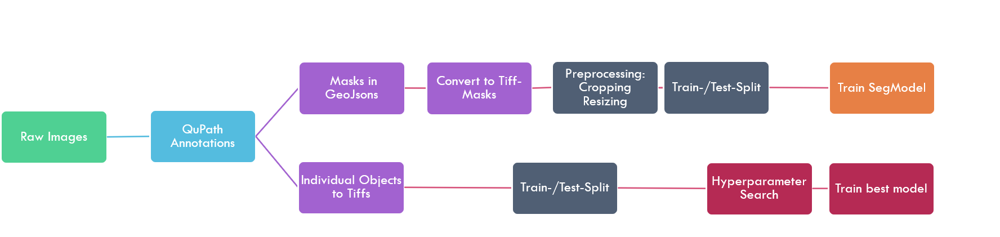
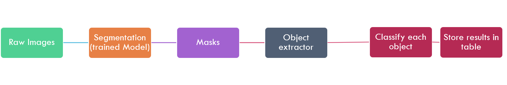

 

# orgaSeg: From image annotations to instance classifications
The purpose of this project is to segment individual organoids from microscopy data and classify them into morphological groups.  
Due to the nature of the data, the project is divided into two parts: segmentation and classification.  
To obtain ground-truth data to train the supervised segmentation and classification models, an annotation using QuPath is expected.  
Alternatively, data folders with individual images, their crops containing one object at a time with a file name containing  `(class_name)` and the masks for the whole images can be provided as well.  
It is worth to mention, that the segmentation step uses a model from an [album catalog](https://gitlab.com/album-app/catalogs/image-challenges-dev), and therefore can be replaced with any other model (e.g. nnUNet, CSBDeep, DeepCell, etc.). We just assumed star-convex polygons/blob-like structures as a start and provide a python script for StarDist2D. If you want to change it, install another album solution from the catalog and run it via CLI or album-gui. 

# Training Pipeline

After cloning the repository, make sure to have pytorch2 with GPU support installed. (We will provide the requirements for conda as YAML soon.)  
Run each of the steps from the directory of the corresponding script.

## Export data

- Open project with annotations in QuPath
- Use `src/export_geojsons_and_rois.groovy` file with instructions on top to export cells & geojsons
- use `src/sort_qupath_object_output.py` to sort the exported data into the correct directory structure for training a classification model 

## Preprocess data

- Use `src/convert_label.py` to convert geojson files to tiffs
- Use `src/preprocess_dataset.py` to preprocess images and masks
- Use `src/split.py` to split segmentation data in train and test data, and create correct dataset structure for segmentation models
- Use `src/split.py` to split classification data in train and test data, and create correct dataset structure for classification models 

## Train segmentation

- Add [image-challenges-catalog](https://gitlab.com/album-app/catalogs/image-challenges-dev) to your [album.solutions](https://album.solutions/) installation.  
- StarDist expects the subfolders for train/test to be named "images" and "masks" (not "labels")
- Use `src/segmentation_album.py` to execute StarDist2D with our recommended settings. Alternatively, use the album-gui or CLI to run any other model provided in the catalog

## Train classifier

- Use `src/classification/nn_pytorch.py` to train a classifier and store the model in the `models/` directory.  
- This step can perform a grid search on a few hyperparameters and model architectures and will return the best performing model whjile displaying the results in TensorBoard.

# Inference Pipeline 

## Segmentation
- Use your segmentation model to predict segmentation masks for a whole directory with new data (album solution: stardist_predict) 

## Extract Objects
- Use `src/segmentation_to_instance_classification.py` to extract the objects from the segmentation masks and store them in a new directory

## Classification
- Use your trained classifier to predict the class of the objects (`src/classification/nn_pytorch.py`) and obtain a csv file with the predictions for each object

# Directory structure
## `data/` directory

- _data_sets_: contains the preprocessed and model-specific reordered data sets used for training and testing
    - _..._: one subdirectory for each model
      - _test_: contains the test data set
        - _img_: contains the test images
          - as tiff files
        - _mask_: contains the test labels
          - as tiff files
      - _train_: contains the train data set
        - _img_: contains the train images
          - as tiff files
        - _mask_: contains the train labels
          - as tiff files
- _preprocessed_: contains the preprocessed data sets
    - _anno_to_mask_: contains the masks generated from the annotations (using the src/convert_label.py script)
      - as tiff files
    - _images_: contains the preprocessed images (using the src/preprocess_dataset.py script)
      - as tiff files
    - _labels_: contains the labels preprocessed from anno_to_mask (using the src/preprocess_dataset.py script)
      - as tiff files
- _raw_data_: contains the raw data sets (unchanged)
  - _annotations_json_: contains the annotations in geojson format
    - as geojson files
  - _raw_images_: contains the raw images
    - as jpg & tiff files

## `src/` directory

- _convert_label.py_: converts the annotations from geojson to tiff format
- _preprocess_dataset.py_: preprocesses the data set (raw images and tiff labels) to the preprocessed data set

## Outlook
We planned to convert this into an easy-to-use pipeline and deploy this as an 'album catalog', so each individual step gets a GUI and the directory structure is not relying on the working directories of each script to be executed. This shall increase replicability and usability.  

## Acknowledgements
We adjusted and tested the pipeline on a very specific dataset of microscopy images of organoids with QuPath-annotations from @tum [Technische Universität München: Friederike Ebner,  Krzysztof Flisikowski, Qixia Chan, Theresa Pauli and Wei Liang (Corresponding Person)]. Thank you for providing this dataset! Therefore, the preprocessing steps are adjusted to these images (4032x3040 px).  
This project sprouted from the seminar "Deep Learning for biomedical applications" of Prof. Dr. rer. nat. Vitaly Belik @Freie Universität Berlin. 
